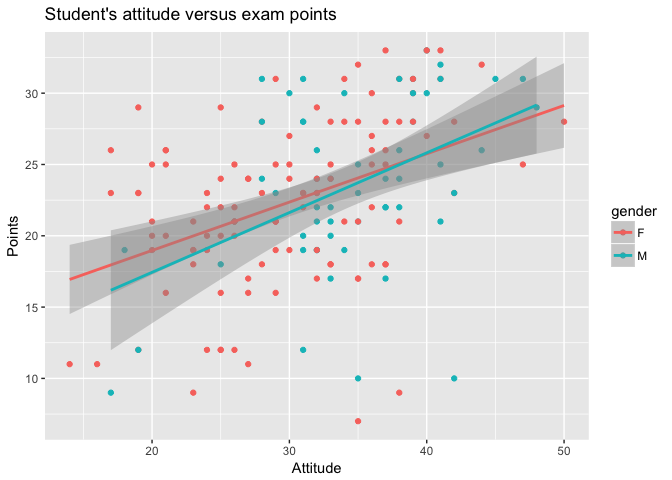
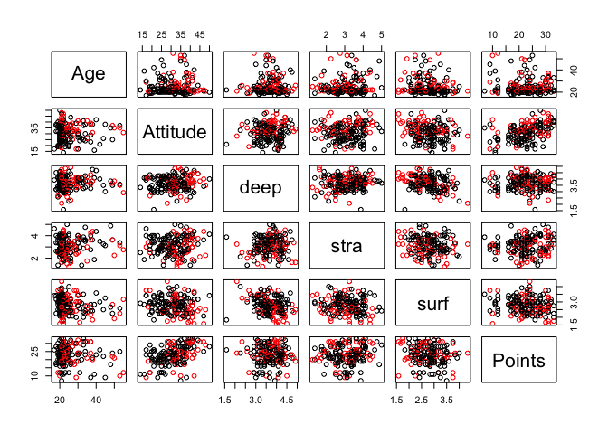
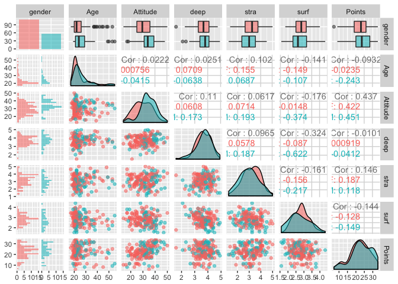

Second exercise
================
Aliisa Koivisto

Regression and model validation
===============================

This week we learned the basic first steps of analyzing data

First lets download the data and explore the dimension and structure of it

``` r
learning14 <- read.csv("data/learning2014.csv")
dim(learning14)
```

    ## [1] 166   7

``` r
str(learning14)
```

    ## 'data.frame':    166 obs. of  7 variables:
    ##  $ gender  : Factor w/ 2 levels "F","M": 1 2 1 2 2 1 2 1 2 1 ...
    ##  $ Age     : int  53 55 49 53 49 38 50 37 37 42 ...
    ##  $ Attitude: int  37 31 25 35 37 38 35 29 38 21 ...
    ##  $ deep    : num  3.58 2.92 3.5 3.5 3.67 ...
    ##  $ stra    : num  3.38 2.75 3.62 3.12 3.62 ...
    ##  $ surf    : num  2.58 3.17 2.25 2.25 2.83 ...
    ##  $ Points  : int  25 12 24 10 22 21 21 31 24 26 ...

That is we have 7 variables: "gender", "age", "attitude", "deep", "stra", "surf" and "points" in the data. Next lets visualize the data

``` r
library(ggplot2)
p1 <- ggplot(learning14, aes(x = Attitude, col =gender, y = Points))
p2 <- p1 + geom_point()
p3 <- p2 + geom_smooth(method = "lm")
p4 <- p3 + ggtitle("Student's attitude versus exam points" )
p4
```



``` r
summary(learning14)
```

    ##  gender       Age           Attitude          deep            stra      
    ##  F:110   Min.   :17.00   Min.   :14.00   Min.   :1.583   Min.   :1.250  
    ##  M: 56   1st Qu.:21.00   1st Qu.:26.00   1st Qu.:3.333   1st Qu.:2.625  
    ##          Median :22.00   Median :32.00   Median :3.667   Median :3.188  
    ##          Mean   :25.51   Mean   :31.43   Mean   :3.680   Mean   :3.121  
    ##          3rd Qu.:27.00   3rd Qu.:37.00   3rd Qu.:4.083   3rd Qu.:3.625  
    ##          Max.   :55.00   Max.   :50.00   Max.   :4.917   Max.   :5.000  
    ##       surf           Points     
    ##  Min.   :1.583   Min.   : 7.00  
    ##  1st Qu.:2.417   1st Qu.:19.00  
    ##  Median :2.833   Median :23.00  
    ##  Mean   :2.787   Mean   :22.72  
    ##  3rd Qu.:3.167   3rd Qu.:27.75  
    ##  Max.   :4.333   Max.   :33.00

``` r
pairs(learning14[-1], col = learning14$gender)
```



``` r
library(GGally)
library(ggplot2)
p <- ggpairs(learning14, mapping = aes(col = gender, alpha = 0.3), lower = list(combo = wrap("facethist", bins = 20)))
p
```

 Students attitudes and exam performance seem to correlate strongly. This correlation might be even stronger for boys. There is double the amount of girls in comparison to boys. The age range is wide between 17 and 55. Lets study the connections further

``` r
my_model <- lm(Points ~ Attitude + gender + Age, data = learning14)
summary(my_model)
```

    ## 
    ## Call:
    ## lm(formula = Points ~ Attitude + gender + Age, data = learning14)
    ## 
    ## Residuals:
    ##      Min       1Q   Median       3Q      Max 
    ## -17.4590  -3.3221   0.2186   4.0247  10.4632 
    ## 
    ## Coefficients:
    ##             Estimate Std. Error t value Pr(>|t|)    
    ## (Intercept) 13.42910    2.29043   5.863 2.48e-08 ***
    ## Attitude     0.36066    0.05932   6.080 8.34e-09 ***
    ## genderM     -0.33054    0.91934  -0.360    0.720    
    ## Age         -0.07586    0.05367  -1.414    0.159    
    ## ---
    ## Signif. codes:  0 '***' 0.001 '**' 0.01 '*' 0.05 '.' 0.1 ' ' 1
    ## 
    ## Residual standard error: 5.315 on 162 degrees of freedom
    ## Multiple R-squared:  0.2018, Adjusted R-squared:  0.187 
    ## F-statistic: 13.65 on 3 and 162 DF,  p-value: 5.536e-08

The parameters of gender and Age do not have a statistically significant relationship, thus we will drop them from the model.

``` r
my_model <- lm(Points ~ Attitude , data = learning14)
summary(my_model)
```

    ## 
    ## Call:
    ## lm(formula = Points ~ Attitude, data = learning14)
    ## 
    ## Residuals:
    ##      Min       1Q   Median       3Q      Max 
    ## -16.9763  -3.2119   0.4339   4.1534  10.6645 
    ## 
    ## Coefficients:
    ##             Estimate Std. Error t value Pr(>|t|)    
    ## (Intercept) 11.63715    1.83035   6.358 1.95e-09 ***
    ## Attitude     0.35255    0.05674   6.214 4.12e-09 ***
    ## ---
    ## Signif. codes:  0 '***' 0.001 '**' 0.01 '*' 0.05 '.' 0.1 ' ' 1
    ## 
    ## Residual standard error: 5.32 on 164 degrees of freedom
    ## Multiple R-squared:  0.1906, Adjusted R-squared:  0.1856 
    ## F-statistic: 38.61 on 1 and 164 DF,  p-value: 4.119e-09

The interpretation of the final model is, that the expected value of points, whenattitude is known: 11.64+0.35\*"Attitude". The R-squared however tells that,this model explains only 19 percent of the dependent variable Points. Thus, there is a lot affecting the value that is not included in the model.
